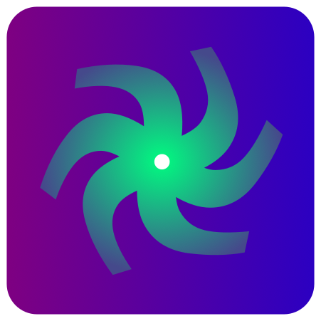

    

    

<a href="[https:https://github.com/LostbBlizzard/UCodeLang/actions](https://github.com/LostbBlizzard/UCodeLang/actions)">

<h1>The UCode Programming Language</h1>

A high level progaming language designed to be fast to write, to compile and to run.

UCode is a programming language designed to be embedded into existing software such as game engines while being a low-level language with modern and high-level features.

mainly

- does not require a garbage collector like C#.
- offers more functionality than Lua.
- is easier to use than C++.
- Uses Compile time power to reduce boilerplate.

# Design Principles/Pillars

- Simple is better than complex.
- Zero-overhead abstractions
  - You don't pay for what you don't use.
  - What you do use is just as efficient as what you could reasonably write by hand.
-  Productive
   - Scalable compilation times
   - Reliable Tooling.
   - gradual learning curve
- Reuseable 
  - multi-paradigm
  - Compile time power

# Supported Progaming Languages

- [C++](https://github.com/LostbBlizzard/UCodeLang) //This Repository
- [C89]() 
- [Rust](https://github.com/LostbBlizzard/UCodelang-Rust)
- [Zig](https://github.com/LostbBlizzard/UCodelang-Zig/tree/main)

# Downloads & Documentation

[WebSite and PlayGround]()

[Download]()

[Documentation]("UCodeDocumentation/src/SUMMARY.md")
//Goto "UCodeDocumentation/src/SUMMARY.md" if link does not work

[VSCode Extension]()

[How To Add To Your C++ Project]("UCodeDocumentation/src/ForImplementers.md")
//Goto "UCodeDocumentation/src/ForImplementers.md" if link does not work

# Project File Structure / github contributions

To Download the project just download files and run 

- The VS_2019.bat file(If you use VSCode 2019) to build vscode project files.

- Other build systems im not sure about. make a pull request if you know how to do it. 

The file Project Structure is lad out like this

- /Dependencies
  - "Contains the premake executable"

- /UC 
  - "Is the command line tool" 
  - "The thing users use to build ucode files and to run ucode."

- /UCApp 
  - "The Testing playground"
  - /src 
    - "use this when testing and debuging features."
    - "I dont care too much for what happends here."
  - /tests
    - "unit test and test helper funcions."

- /UCodeAPI
  - "lots of ucode files"
  - "contains the standard library and other librarys."

- /UCodeLang
  - "the core of ucode-lang if your useing this as a library add this to your include directory"
  - /Dependencies
    - "decompilers for testing"

  - /UCodeAnalyzer 
    - "classes/funcions for the UCodeLanguageSever."
    - "Tools for analyzing UCodeLang"

  - /UCodeLang
     - /Compliation
       - "were ucode get compiled"
     - /LangCore
       - "helpers and other stuff".
     - /RunTime
       - "were your Interpreter jit-Interpreters and runtime live"
       - "the jit-Interpreter compilers is in UCodeLang/Compliation/Back"
    
- /UCodeLanguageSever
  - "the runable language sever"
  - /src
    - "the code"

- /UCodeLanguageSeverLib
  - "the language sever with json and Language Server Protocol"
  - /json-develop
    - "json library"
  - /src
    - "the code"

- /UCodeDocumentation
   - "Were UCodeDocumentation is"
   - /Standardlibrary
     - "Generated from /UCodeAPI/UCodeDocumentation"

- /UCodeIDE
   - "Its use is for testing things that would be hard to test useing a debuger"

- /UCodeWebsite
   - "Were the UCodeWebsite is im not a web dev so it's probably just the bare minimum"
 

The project is meant too have as few dependencies as possable because it is meant to be easy to added to any c++ pojects.

use the github issue tab for bugs.
use the github discussions to talk about the language and new features and language design.
also keep it civil.

The final vision of the Project has Backends for 
 - UCodeVM(Interpreter,JitInterpreter,NativeInterpreter)
 
 - C89

 - LLVM Assembly text.

 - Web Assembly text

 - Windows,

 - Linux,

 - MacOs,

# Credits
The was Language was designed  and developed by LostBlizzard On [GitHub](https://github.com/LostbBlizzard).

Who currently maintains the 

- The [UCodeLang](https://github.com/LostbBlizzard/UCodeLang) cplusplus implementation of the language.

The UCodeGameEngine(being worked on) the primary reason The Language was made.

# QA

-  Q: UCodeLang is very similar to c++ and rust why not use Rust or C++?

   A: C++ is too compilcaicated of a language and is unanalyzable after compiling(without hacking the compiler).rust memory features is not that usefull for my use cases and c++ Smart Pointer's is all i need.

- Q: Why is it written in c++.

  A: Most Game Engines and specificaly my game engine is written in c++.c++ is stil the best tool for makeing game engines.

- Q:Why not use LLVM for your backend.

  A:LLVM is too big of a dependency and writeing backends my self gives me a good excuse to learn about Computers(The Reason im makeing a game engine).
   Also you just output llvm assembly text.

- Q:Why significant white space?

  A:Just Seemed Interesting also just looks nicer. 

- Q:UCodeLang just seems takes ideas from other languages does not do anything new. 

  A:UCodeLang is not the next big thing it's just a tool made for my specific use case.It takes the best Parts from languages i like and attempts to remove excess. 

- Q:What does UCode mean? 
  
  A:The word UCode means nothing and has no history it just just a name I made up for a progaming language idea.if you realy want a meaning a meaning it when the idea was made it stand for Unsigned Code based on c/c++ unsigned keyword.

- Q:Do you like c++?

  A:I like it enough to spend a year makeing a new language useing it but not enough to make my users for my Game Engine Use it(Sorry unreal).

- Q:what next and when will be Language be done.

- A:When the repository Opens (preferably on 1/2/2023 The one year anniversary of makeing the jit project) most features would be done and dont really plan on adding more unless it Just too Good. I'll be around for an extra year to finsh up the other architectures and backends and stabitly.at that point the project will be done and i can go on working on that game engine and go to work on biger and better things.

